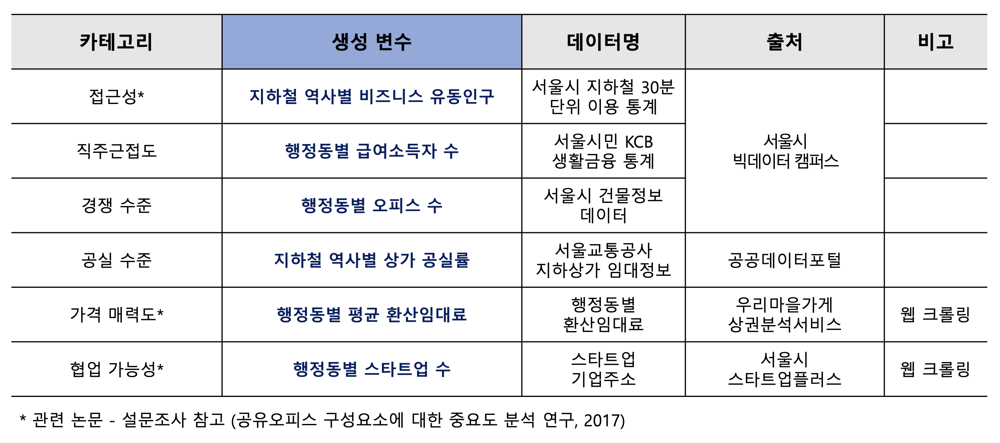
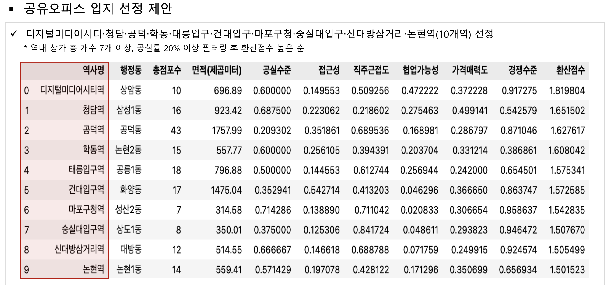

# 2022 서울시 빅데이터캠퍼스 공모전
지하철 공실 문제 해결을 위한 공유오피스 도입 및 활성화 방안 (우수상 수상)

[배경]
- 서울교통공사 적자에 따른 지하철 서비스의 지속가능성 이슈
- 코로나19 이후 오프라인 상권 약화에 따라 서울시 지하철 상가의 공실 장기화
    - 코로나19 이후 지하철 승하차인원은 점차 증가 추세이나, 공실률 회복은 지연
    - “공간 활용의 출발점”으로 공유오피스 선택

[목적]
- 지하철 역내 공유오피스 입지 선정
    - 행정동별 지하철 이용현황, 인구, 사업체 및 오피스 특성 등 분석 
    - 데이터를 종합적으로 반영하여 입지 선정 제안

- 공유오피스 활성화 아이디어 제안
    - 군집분석 및 세그먼테이션 기반 역내 공유오피스별 특성 파악 
    - 공유오피스 특성별 맞춤 활성화 아이디어 제시

[데이터]

[분석]

[주요 툴]
- (데이터 프로세싱) 판다스, 넘파이
- (데이터 수집) SQL, request, Selenium
- (지도 데이터) 폴리움

