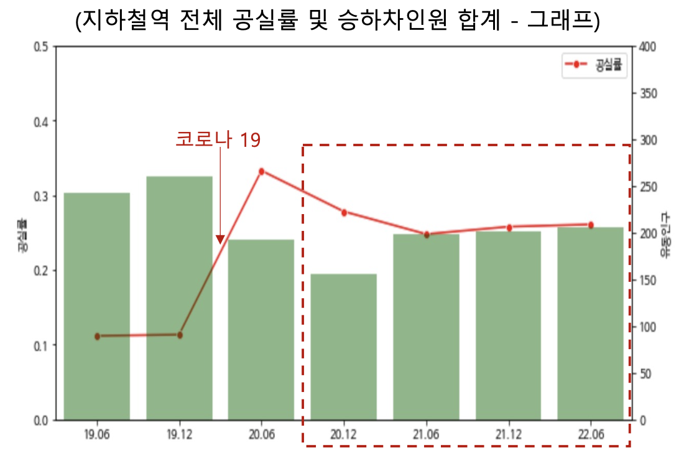
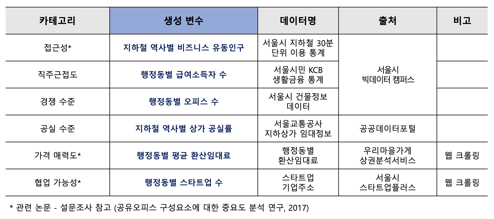
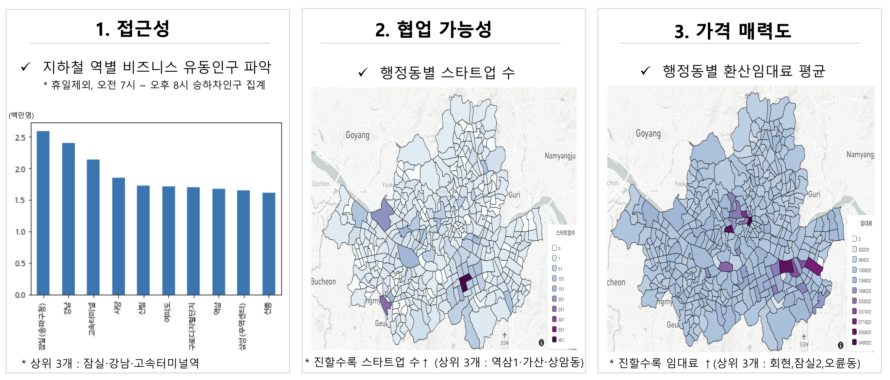
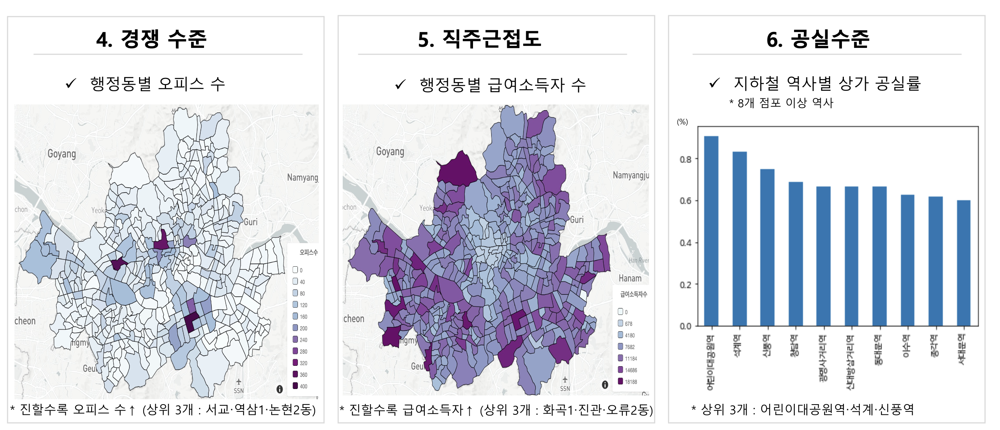
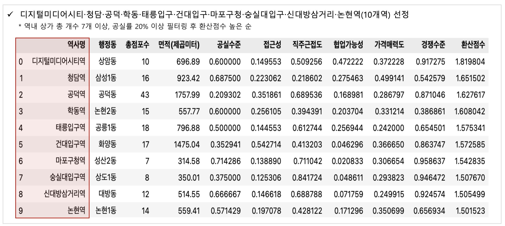
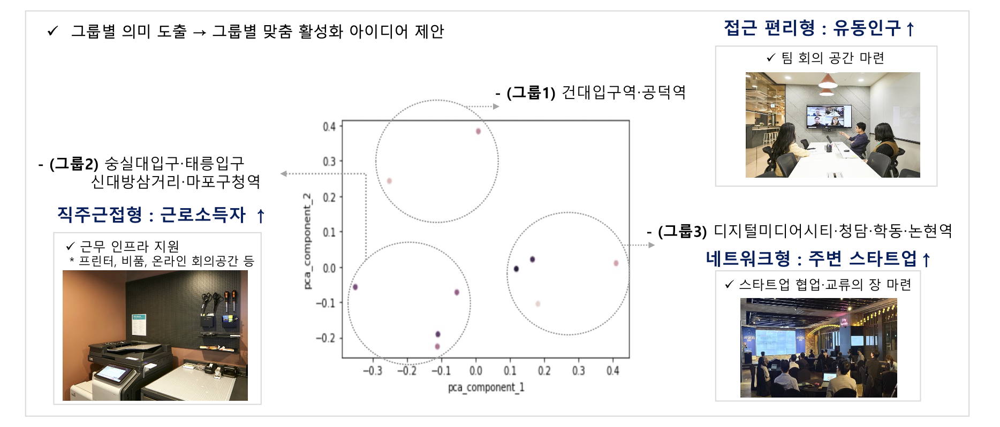

# 지하철 공실 문제 해결을 위한 공유오피스 도입 및 활성화 방안 

- 2022 서울시 빅데이터캠퍼스 공모전 - 우수상

### 배경
> 문제점
- 코로나19 이후 오프라인 상권 약화에 따른 **서울시 지하철 상가의 공실 장기화**

    - [데이터 시각화] 코로나19 이후 지하철 승하차인원은 점차 증가 추세이나, 공실률 회복은 지연

        

- [문제 인식] 지하철역을 경유하는 **유동인구 증가만으로는 공실 문제해결에 한계**

        
    

> 해결방안
- "공간 활용의 출발점"으로 공유오피스 도입

    - 지하철을 단순 경유지가 아닌 **목적지로 만드는 공간 활용 가능**

### 제안
> 목표
- 지하철 역내 **공유오피스 입지 선정** → **공유오피스 활성화 아이디어** 제안

    - 데이터 분석 기반 지하철 역별 특성을 파악

    - 군집분석 및 세그먼테이션 기반 공유오피스 활성화 아이디어 마련

> 데이터 

- 활용 데이터 : 총 6개

    - (카테고리) 접근성 ・ 직주근접도 ・ 경쟁수준 ・ 공실수준 ・ 가격매력도 ・ 협업가능성 선택
        - 카테고리별 데이터 정의 및 수집

            

    - (전처리) 지하철 역별 행정동 매칭

        

> 분석
- 카테고리별 데이터 시각화

    
    

> 입지 선정
- 카테고리별 점수 정규화(Min-Max scaling) 및 총합 : 10개역 선정

    

> 활성화 아이디어
- 10개역 데이터 : 주성분분석 → 세그먼테이션 → 의미 도출 및 아이디어 마련

    

### 기대효과
- 일차적인 공실 해소뿐만 아닌 **지하철 역사내 활동인구 증가에 따른 상권 활성화**

### 한계 및 개선점
- 정성적 데이터 ・ 현장 의견 - 반영 필요

- 기존 행정동 범위를 세분화 : 특정 블록 또는 m 단위 분석 필요
    - 상권활성화 가능 범위 계산

- 구체적 기대효과 지표 제시 필요
    - (예시) 공유오피스 개점 전후 유동인구 비교 분석 

### 활용 툴
- (데이터 처리) Python, Pandas, Numpy

- (데이터 수집) SQL, Request, Selenium
- (데이터 시각화) Seaborn, Folium

